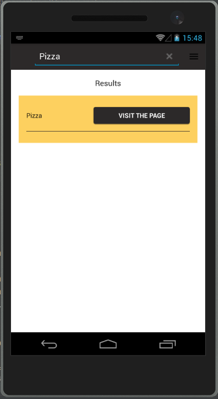
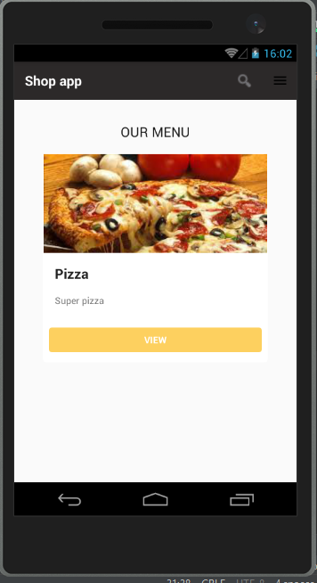
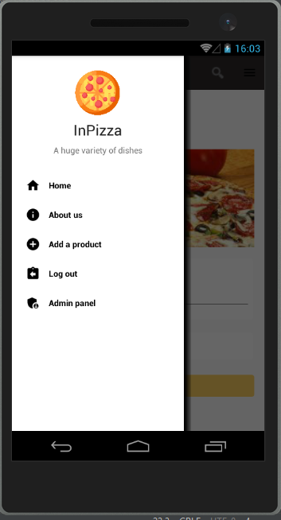
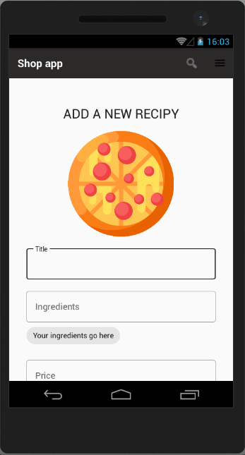

# Android_App
I have created the app, where users can order dishes and admin can publish them. 

## How to run the app? 
In order to run the app in Android Studio
* The firebase realtime database must be enabled. 
* Firebase authentication must be allowed (using email adn password). 
* If you want to sign in as admin, create user in firebase authentication system with such email as `adminadmin@gmc.com`. After you can log in as admin.
* Firebase firestore must be enabled
